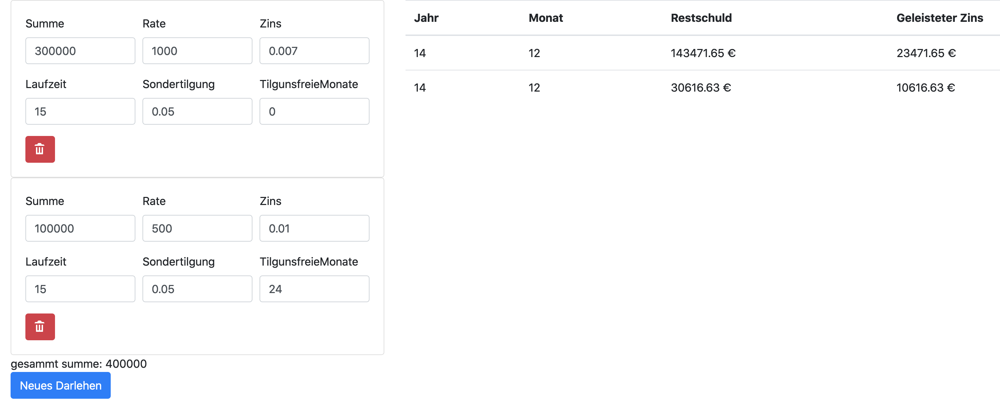

# Credit Calculator
Used to simulate long running credits (i.e. for buying a house).
See [Calc.scala](./src/main/scala/de/dheinrich/Calc.scala) for a detailed example simulation.

## Features
- define multiple incomes and how they change over time (i.e. inflation, temporary loss of income)
- define multiple different credit contracts, which can start at different times
 
## Interactiv Visualisation
Run `sbt ~fastOptJS` this will start a local webserver. Access
http://localhost:12345/index-dev.html to play with the visualization.
